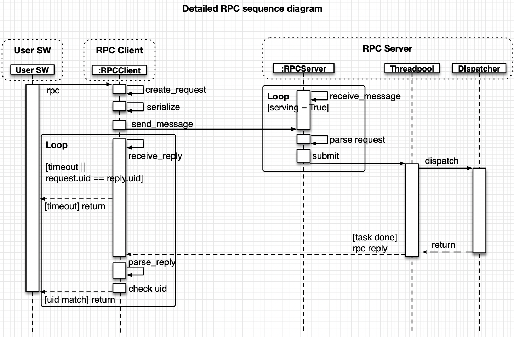
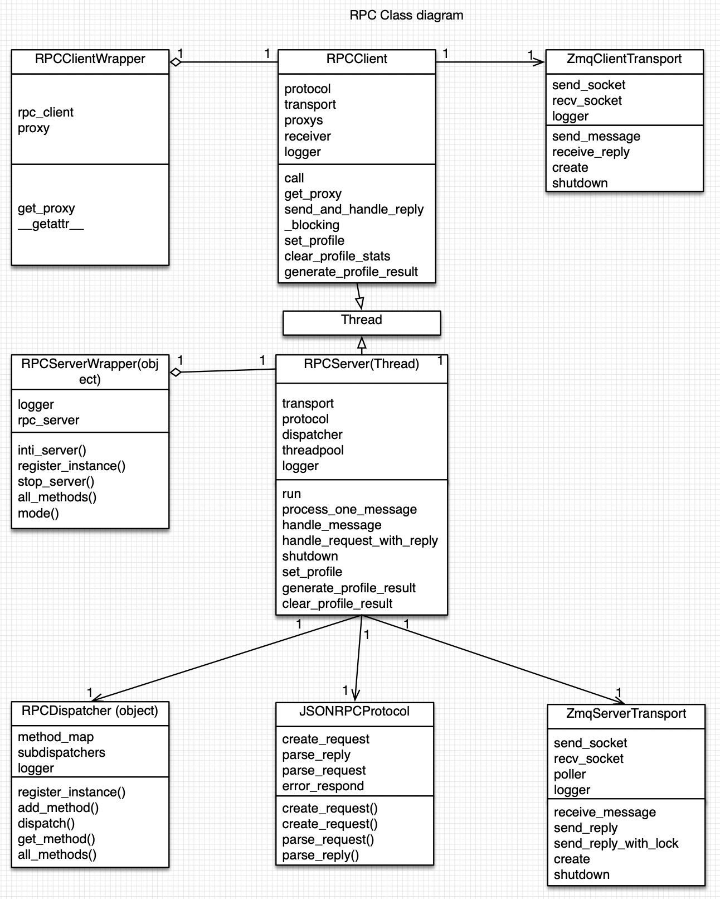
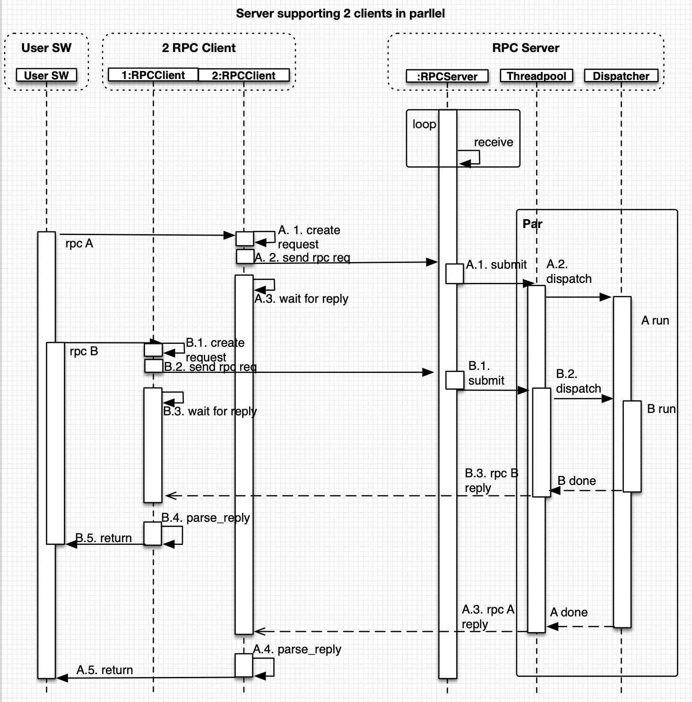
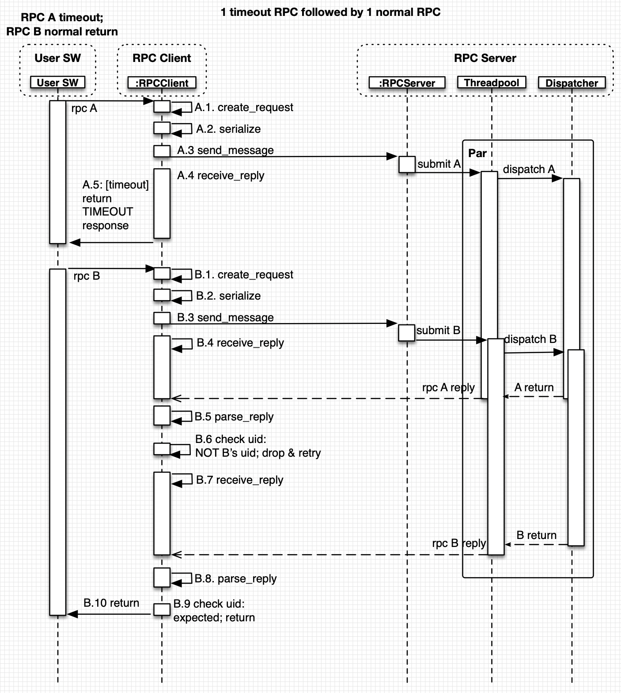

# RPC Server/Client (python) Specification

Tinyrpcx is part of MIX Firmware RPC (Remote Procedure Call) framework which is extended upon tinyrpc. It is core components in MIX Firmware. It includes RPC server and python version RPC client.

We also offer Objective-C version RPC client framework.

## User Guide

### Main features

    1. Synchronous RPC
    2. Timeout detection and reporting
    3. Multiple clients to one RPC server

### Preparation

Change current directory into the root folder of tinyrpcx before starting. This is to avoid possible import path error. You should be able to locate **rpc_server.py**, **rpc_client.py** and **publisher.py** in current directory.

### tinyrpcx package imports

On Xavier or on Mac with rpc client pkg (radar 43830636, 2.0.4+) installed, tinyrpcx could be imported as mix.lynx.rpc:

```python
from mix.lynx.rpc import RPCServerWrapper
from mix.lynx.rpc import RPCClientWrapper
```

### Start RPC server

```python
from mix.lynx.rpc import RPCServerWrapper
server = RPCServerWrapper('tcp://*:5556')
```

Above code will create a RPC server listening on TCP port 5556. RPC server starts after being created.

### Start RPC client

```python
from mix.lynx.rpc import RPCClientWrapper
client = RPCClientWrapper(ip='127.0.0.1', port=5556)
# or
client = RPCClientWrapper('tcp://127.0.0.1:5556')
```

Above code will create a RPC client connected to TCP port 5556 on local machine. Client is usable after being created.

### Send RPC Request from Client to Server

With server and client been created following steps above.

```python
ret = client.server.mode()
print(ret)
# ret will be "normal"
```

Above code will call **server.mode()** function (RPC service) remotely on server.
**server.mode()** is mapped to **mode()** function as member of class **RPCServerWrapper**.

### Check Log

Open log/rpc_log_server_PORT_TIMESTAMP.log to check RPC server log.
User should find 3 types of log entries:

1. server start

    2019-04-11 11:59:32,101:1554955172.101467:INFO:rpc_server:rpc server tcp://*:5556 started.

2. request received

    2019-04-11 11:59:34,973:1554955174.973517:INFO:zmq:received: 9D7032F1-2FEB-4637-AA01-93161D802021 {"jsonrpc":"2.0","id":"7AE833FB-2149-4390-901C-A468147FB9B4","method":"server_mode","args":[]}

3. reply sent

    2019-04-11 11:59:34,973:1554955174.973973:INFO:zmq:sent: 9D7032F1-2FEB-4637-AA01-93161D802021 {"jsonrpc":"2.0","id":"7AE833FB-2149-4390-901C-A468147FB9B4","result":"normal"}

## Developer Guide

### Develop new RPC service (example)

1. Create a new file named "service.py".

    Mind that the new file should be under the same root folder of tinyrpcx.

2. Create a new function named foo() in class Demo:

```python
class Demo(object):
    def foo(self, arg):
        print 'foo({}) being called.'.format(arg)
        return arg
```

foo() only returns what is passed to it as arg and prints a message to console.

3. put function name "foo" in "rpc_public_api" class variable

```python
class Demo(object):
    rpc_public_api = ['foo']

    def foo(self, arg):
        print 'foo({}) being called.'.format(arg)
        return arg

    def non_rpc_func(self):
        '''
        Functions whose name not in rpc_public_api list;
        Will not be available over RPC.
        '''
        pass
```

4. Create new instance of Demo

```python
class Demo(object):
    rpc_public_api = ['foo']

    def foo(self, arg):
        print 'foo({}) being called.'.format(arg)
        return arg

    def non_rpc_func(self):
        '''
        Functions whose name not in rpc_public_api list;
        Will not be available over RPC.
        '''
        pass


a_demo = Demo()
```

5. Start RPC server and register the instance to server

```python
from mix.lynx.rpc import RPCServerWrapper

class Demo(object):
    rpc_public_api = ['foo']

    def foo(self, arg):
        print 'foo({}) being called.'.format(arg)
        return arg

    def non_rpc_func(self):
        '''
        Functions whose name not in rpc_public_api list;
        Will not be available over RPC.
        '''
        pass


a_demo = Demo()
from mix.lynx.rpc import RPCServerWrapper
server.register_instance({'mydemo': a_demo})
```

6. Create a RPC client and try to call foo()

```python
from mix.lynx.rpc import RPCClientWrapper
from mix.lynx.rpc import RPCServerWrapper

class Demo(object):
    rpc_public_api = ['foo']

    def foo(self, arg):
        print 'foo({}) being called.'.format(arg)
        return arg

    def non_rpc_func(self):
        '''
        Functions whose name not in rpc_public_api list;
        Will not be available over RPC.
        '''
        pass


a_demo = Demo()
server = RPCServerWrapper('tcp://*:5556')
server.register_instance({'mydemo': a_demo})

client = RPCClientWrapper(ip='127.0.0.1', port=5556)
ret = client.mydemo_foo('Hello')
assert ret == 'Hello'
```

### RPC Service Auto Discovery (launcher)

Launcher is designed to do below jobs.

    1. Create RPC Server as defined in configuration file profile.json
    2. Create driver instance then register to RPC server as defined in profile.json
    3. Search python classes of RPC services within specified directory and create instance for valid classes and register to RPC server.
    4. Misc Xavier initialization, such as setting network and launching standalone program.

Reference:
Launcher src:  <https://hwtegit.apple.com/MIX-Lynx/launcher/tree/master/src/launcher>
Launcher flowchart:  <https://hwtegit.apple.com/MIX-Lynx/launcher/tree/master/designdocs>
Launcher spec: <https://confluence.sd.apple.com/display/SMT/Launcher>

## Feature Design Specification

### Request-Response RPC

RPC is short for Remote Procedure Call, which is to execute an function on a remote machine, usually another end of ethernet cable.

Tinyrpcx includes both RPC client and RPC server:

    1. Client: convert user request into dictionary, then serialize dictionary to network payload(string), and send to server.
        Then client wait for server's response, parse and unpack into real function return value and return to user.
        The wait is a block wait with timeout.
    2. Server: wait and receive for RPC request, parse request into dictionary and make requested function call;
        When function execution finished, result is wrapped into dictionary and sent back to client.

### RPC Sequence Diagram



### RPC Class Diagram



### RPC Service registration

A RPC service is a function of a class instance, with function name listed in class "rpc_public_api" variable.

A module function that does not belong to a class instance cannot register as RPC service.

To make a function work as RPC service, user need to register the instance to the server using register_instance():

```python
    server.register_instance({'driver': driver})
```

Input argument is a dictionary: key is instance's registered name, value is instance itself.
The following example will register "driver" instance without a prefix, which will work but is not recommended:

```python
    server.register_instance(driver)
```

With above code, the instance's attributes will be examined and sub-instance and memeber functions will be identified.

For function (callable), if its name is in "rpc_public_api" list, server will record its function name and function pointer in dispatcher.

Function not in the list will be ignored.

Example:

```python
    class A:
        rpc_public_api = ['foo']

        def func():
            ...

        def another_func():
            ...

    server.register_instance({'f': foo})
    instance foo:
            |-> func():                 # RPC: accessbile as "f_func()"
            |-> another_func():         # RPC: not accessible
```

### Multi-clients to Single Server

Multiple clients could send requests to one single server; server could receive all requests and handle each request in different way.

Each client should be used in one thread; client itself is thread-safe but there is no performance benefit to share one client across multiple threads.

RPC requests from multiple clients will be served in parallel at server end in a threadpool.

Each task in threadpool will run requested function call and reply with function result using server transport.

The server transport has a dedicated socket for replying back to client. All the task in threadpool will compete for this socket and send back reply with locking.

### Two Clients Send RPC concurrently



### Client Timeout Handling

Client timeout is defined as:

    Client did not get server's reply in given time. Default time is 3000ms.

User software will receive an Exception with message prefixed with the following string for client timeout:

```bash
"[RPCError] Timeout waiting for response from server"
```

### RPC Timeout Response Handling



### Retry: no builtin support
RPC implementation does not support builtin retry.
This is to avoid silent retry covering actual hardware/software issues.
User software could implement RPC retry on top of RPC, if really need to.

### Logging

!!! note
    Python version RPC client does not support logging currently.

For RPC Server, two log files will be created at tinyrpcx/log folder.

* RPC Server log:

    Record Server event, including message been received and sent for every RPC request, and all failures out of RPC server code.

    File name: rpc_server_PORT_TIMESTAMP.log

* RPC Service log:

    Record RPC service log created by "self.logger.info(msg)" in RPC service (like driver code)

    Each server has one shared logger for RPC service, and it is created in server and passed down to driver/test_function instances during register_istance(), so RPC service itself does not need to create their own logger.

    File name: rpc_server_PORT_service_TIMESTAMP.log

### Logging Control

Python RPC server logging utilize standard python logging module and support logging levels of DEBUG, INFO, WARNING, ERROR and FATAL.

Any log at level lower than current logging level will not be recorded in log file.

Default logging level is INFO; this means by default all DEBUG log will not be in log file, and all INFO and ERROR log will be in log file.

Logging level could be changed through RPC call at runtime; see example below:

```python
client.server_set_logging_level(ERROR)
```

This will change logging level to ERROR, and transport log like below will not be recorded to log file:

```bash
2019-02-15 14:54:59,500:1550213699.500854:INFO:zmq:sent: dd6dfb90a760466b9ec3645ed3a2a295 {"jsonrpc":"2.0","id":"75d76716c9154a108a3a70835b02a932","result":"normal"}

2019-02-15 14:54:59,501:1550213699.501338:INFO:zmq:received: dd6dfb90a760466b9ec3645ed3a2a295 {"jsonrpc":"2.0","method":"server_stop","id":"84efde7818c74613a2bbd3b194917e7f"}
```

### Profiling

Tinyrpcx has builtin profiling feature to measure time performance breakdown at function level (through cProfile) and phase breakdown (by recording time.time() in code). Profiling is by default disabled.

Steps to do profiling:

1. Start server on target
    Target could be MacOS or Xavier.
    Use the following code to start server.

```bash
python start_python_rpc_server.py
```

1. Run profiling and check console output:

```bash
python profile_client.py SERVER_IP
# SERVER_IP could be omitted if 127.0.0.1.
```

### More Profiling Configuration

1. Whether to do cProfile breakdown

    There are 2 types of profile performed:

    i) Use time.time() to get time delta between two timestamps.

    ii) cProfile breakdown of every function call; have overhead.

    time.time() is used to measure total actual time of a certain function, from line to another line.
    It does not add much overhead and could reflect actual performance.

    cProfile will provide detailed function breakdown, which is useful when need to determine which functions are taking unreasonable time.
    But it brings more overhead: e.g. threadpool submit time when using time.time() is about 380us when measuring on Xavier, but with cProfile enabled
    it will grow to 500us.

    When profiling, by default time.time() profiling is enabled and cProfile is disbaled.
    If cProfile is needed, developer need to mofidy line 33 in profile_client.py to

```python
client.server_profile_enable(True, True)
```

2. Profile on multi-clients for multi-server to simulate multi-up fixture

Start multiple server:

```bash
python start_python_rpc_server.py NUM_SERVER
# for example, "python start_python_rpc_server.py 8" will start 8 server
# using the same IP and port from 5556 to 5563
```

Run profile client:

```bash
python profile_client SERVER_IP NUM_SERVER CLIENTS_PER_SERVER [CYCLE]
```

Example:

```bash
# run 1 client for 1 server on 192.168.99.12, send 10 rpc and get average RTT.
python profile_client 192.168.99.12 1 1 10

# run 4 client for each of the 8 server on 192.168.99.12, send 5000 rpc and get average RTT.
python profile_client 192.168.99.12 8 4 5000
```

#### Detailed code

To enable client profile:

```python
client.set_profile(breakdown, rtt)
# breakdown True: enable cProfile for function breakdown
# rtt True: enable phase breakdown
```

To enable server profile:

```python
client.server_profile_enable(breakdown, rtt)
# breakdown True: enable cProfile for function breakdown
# rtt True: enable phase breakdown
```

Client phase breakdown result:

```python
profile_result = client.rpc_client.generate_profile_result()
avg_list = [sum(profile_result[key]) / len(profile_result[key]) for key in profile_result['keys']]
print ''.join(key.rjust(15) for key in profile_result['keys']) + 'sub-total'.rjust(15)
print ''.join(['{:.3f}us'.format(data).rjust(15) for data in avg_list]) + '{:.3f}us'.format(sum(avg_list)).rjust(15)
```

Server profile result:

```python
breakdown_server, server_profile_result = client.server_get_profile_stats(timeout_ms=10000)
# server_profile_result contains combined phase breakdown of server main thread
```

Print server function breakdown:

```python
print 'ncall'.rjust(10), 'total time', 'cumulative time', 'func'
for k, v in sorted(breakdown_server.items(), key=lambda (k, v): v['cum_avg'], reverse=True):
    print str(v['ncall']).rjust(10), pstats.f8(v['tot_avg']), pstats.f8(v['cum_avg']), k
```

Print server phase breakdown:

```python
any_key = server_profile_result['keys'][0]
num = len(server_profile_result[any_key])
avg_list = [sum(server_profile_result[key]) / len(server_profile_result[key]) for key in server_profile_result['keys']]
print ''.join(key.rjust(15) for key in server_profile_result['keys']) + 'sub-total'.rjust(15)
print ''.join(['{:.3f}us'.format(data).rjust(15) for data in avg_list]) + '{:.3f}us'.format(sum(avg_list)).rjust(15)
```
